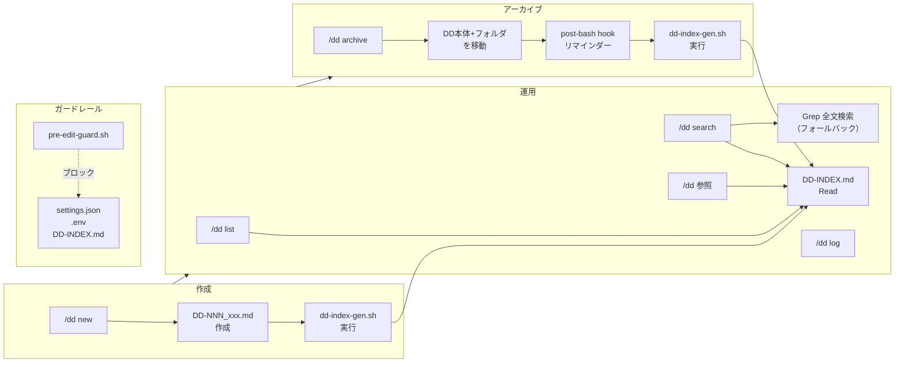
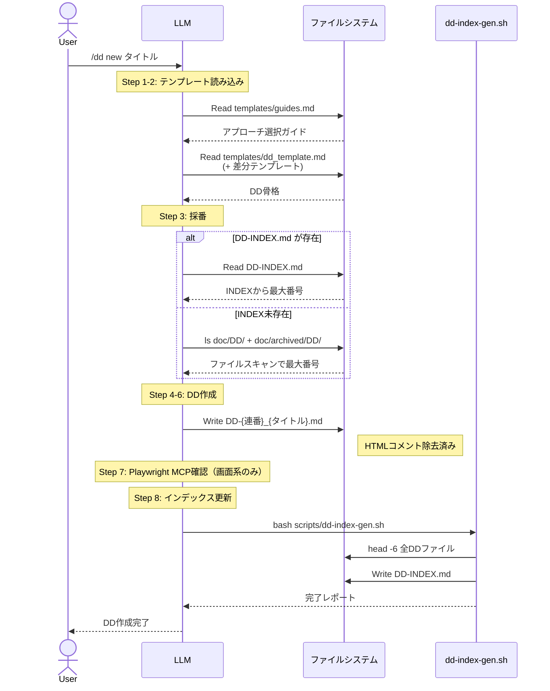
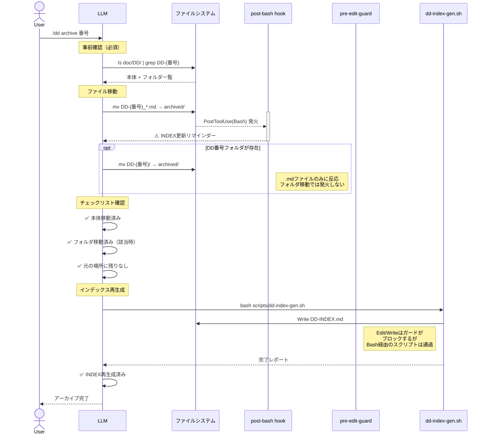
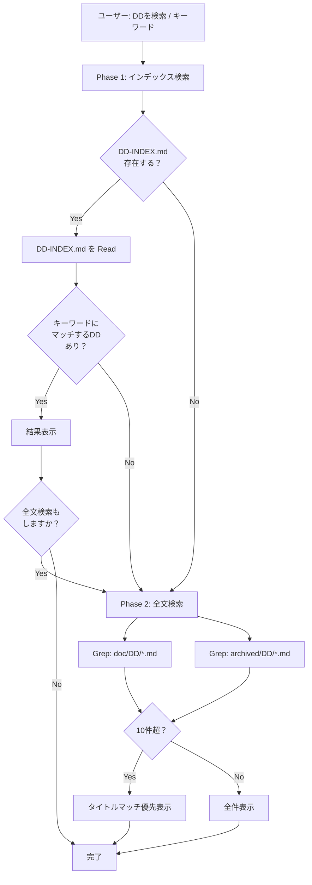
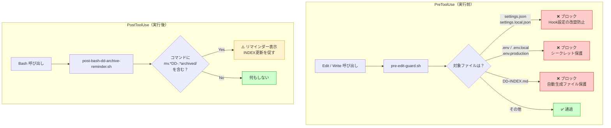
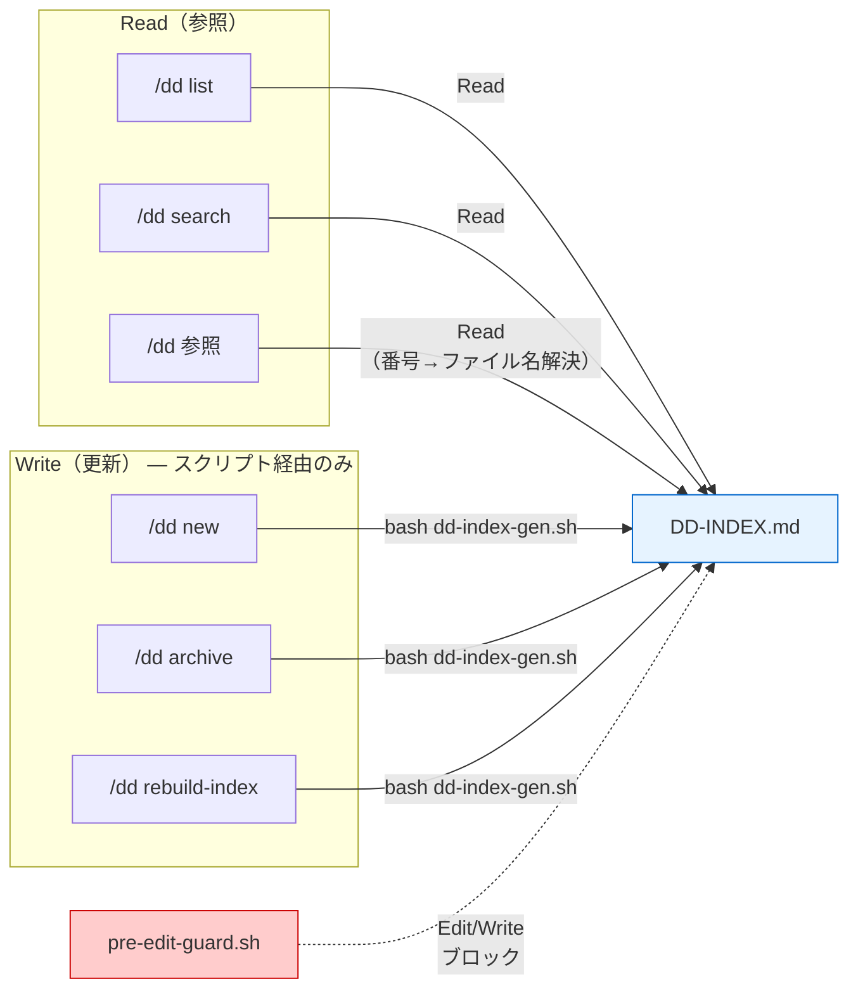

# DD スキル アーキテクチャ

DDスキルの各操作における、LLM・ファイル・フック・スクリプトの連動を可視化した設計書。

---

## 1. 全体俯瞰: DDライフサイクル

---

## 2. DD新規作成フロー

---

## 3. アーカイブフロー

---

## 4. 検索フロー

---

## 5. Hooks 発火タイミング

---

## 6. DD-INDEX.md アクセスパターン

---

## 設計原則

| 原則 | 説明 |
|------|------|
| **INDEX更新は常にスクリプト経由** | LLMの直接編集をpre-edit-guardでブロックし、`dd-index-gen.sh` のみが書き込む |
| **運用の健全性も機械検証** | 「DD運用が回っているか」をLLMの自己申告ではなく `dd-health.sh` の静的分析で測る（滞留・クローズ漏れ・ログ形骸化・DA雛形残置の検出。テレメトリ不要 — DD本体そのものが分析対象） |
| **スクリプトは冪等** | 何度実行しても同じ結果。壊れたINDEXはいつでも再生成可能 |
| **Hooksは人間が設定** | settings.json のフック設定はLLMではなく人間が手動で行う |
| **フォールバック設計** | INDEX未存在時はファイルスキャンで動作。スクリプト未存在時はユーザーに通知 |
